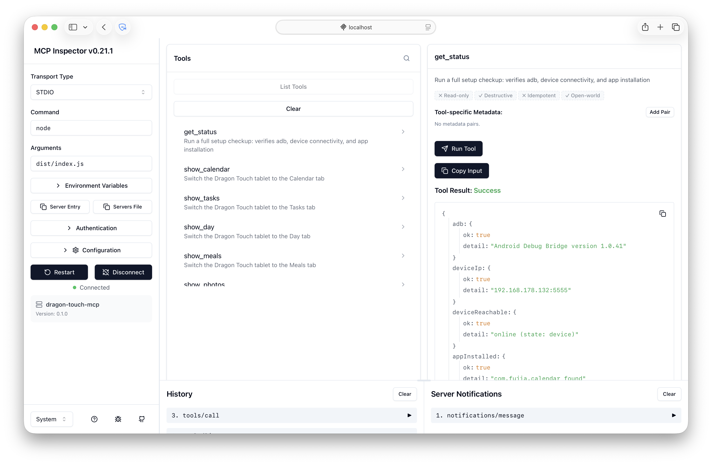

# dragon-touch-mcp

Control a Dragon Touch Android tablet from Claude over ADB via network.

Developed on the 27" TM27 model — should work on other Dragon Touch sizes (21", 32", etc.) since tab switching is based on Android resource IDs, not hardcoded coordinates.



## Requirements

- Node.js 18+
- `adb` in PATH — [Android SDK Platform Tools](https://developer.android.com/tools/releases/platform-tools) (macOS: `brew install android-platform-tools`)
- Tablet reachable over the network with ADB enabled (`adb tcpip 5555`)

## Add to Claude

```bash
claude mcp add dragon-touch -e DRAGON_TOUCH_IP=192.168.178.132 -- npx dragon-touch-mcp
```

Replace `192.168.178.132` with your tablet's IP address.

| Variable | Default | Description |
|---|---|---|
| `DRAGON_TOUCH_IP` | — | Tablet IP address (required) |
| `DRAGON_TOUCH_PORT` | `5555` | ADB port |

## Tools

| Tool | Description |
|---|---|
| `get_status` | Check adb, device connectivity, and app installation |
| `get_device_info` | Read screen state (brightness, rotation, awake), audio volumes, battery, and device model |
| `get_app_settings` | Read app configuration from SharedPreferences (language, weather, sleep schedule, UI settings) |
| `set_brightness` | Set screen brightness (0–255) and disable auto-brightness |
| `set_volume` | Set media volume (0–15) |
| `get_active_tab` | Return the currently active tab/view |
| `capture_screen` | Take a screenshot of the tablet |
| `calendar_get_schedule` | Read all visible events from the current calendar view (day, week, or month) |
| `calendar_set_view` | Switch the calendar to day, week, month, or schedule view |
| `calendar_navigate` | Navigate the calendar forward or backward (1–30 steps, unit = active view) |
| `calendar_set_filter` | Show or hide family member profiles in the calendar filter |
| `show_calendar` | Switch to Calendar tab |
| `show_tasks` | Switch to Tasks tab |
| `show_day` | Switch to Day tab |
| `show_meals` | Switch to Meals tab |
| `show_photos` | Switch to Photos tab |
| `show_lists` | Switch to Lists tab |
| `show_sleep` | Switch to Sleep tab |
| `show_goal` | Switch to Goal tab |

Tab switching uses Android resource IDs — works regardless of screen rotation or app language.

## CLI Usage

Every tool is also available as a CLI command — useful for scripting and automation without an MCP client.

```bash
# No payload needed
DRAGON_TOUCH_IP=192.168.178.132 npx dragon-touch-mcp show_calendar
DRAGON_TOUCH_IP=192.168.178.132 npx dragon-touch-mcp get_status

# With --ip flag
npx dragon-touch-mcp --ip 192.168.178.132 show_tasks

# capture_screen saves a PNG file (default: ./dragon-touch-capture.png)
DRAGON_TOUCH_IP=192.168.178.132 npx dragon-touch-mcp capture_screen
DRAGON_TOUCH_IP=192.168.178.132 npx dragon-touch-mcp capture_screen '{"output": "/tmp/shot.png"}'
```

All commands output JSON to stdout and errors to stderr. Exit code `0` on success, `1` on error.

## Development

```bash
git clone https://github.com/sveneisenschmidt/dragon-touch-mcp.git
cd dragon-touch-mcp
npm install
npm run build       # compile TypeScript
npm test            # run unit tests
npm run inspect     # MCP Inspector at http://localhost:5173
npm run dev         # watch mode
```

On macOS/Linux a `Makefile` is also available with the same targets plus `make clean`.

## Contributing

See [AGENTS.md](AGENTS.md) for architecture and conventions.

## License

MIT
